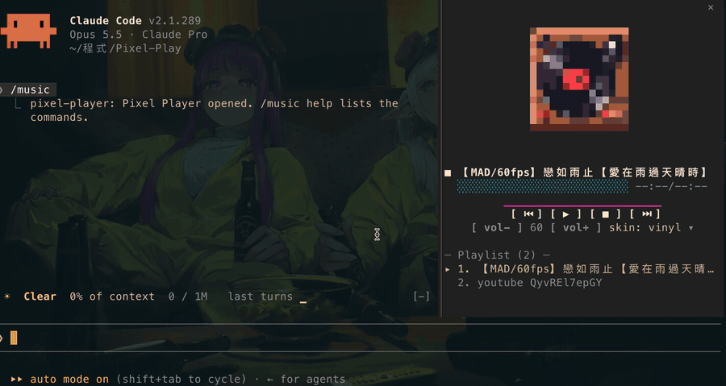
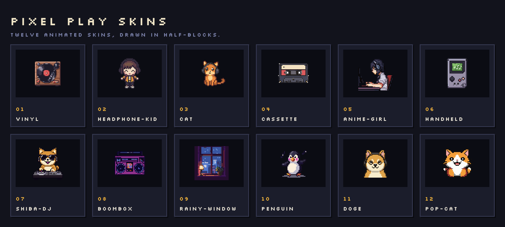

<a id="readme-top"></a>

<div align="center">

[![Stars][stars-shield]][stars-url]
[![Version][version-shield]][version-url]
[![License][license-shield]][license-url]
[![Made for Claude Code][made-for-shield]][made-for-url]
[![Views][views-shield]][views-url]

<br />

<a href="https://github.com/chrisluo5311/Pixel-Play">
  
</a>

<h1 align="center">Pixel Play</h1>

<p align="center">
  A pixel-art music player that docks beside your Claude Code conversation.
  <br />
  <a href="#usage"><strong>Explore the commands »</strong></a>
  <br />
  <br />
  <a href="assets/demo/demo.mp4">View Demo</a>
  ·
  <a href="https://github.com/chrisluo5311/Pixel-Play/issues/new?labels=bug">Report Bug</a>
  ·
  <a href="https://github.com/chrisluo5311/Pixel-Play/issues/new?labels=enhancement">Request Feature</a>
</p>

</div>

<details>
  <summary>Table of Contents</summary>
  <ol>
    <li>
      <a href="#about-the-project">About The Project</a>
      <ul>
        <li><a href="#built-with">Built With</a></li>
      </ul>
    </li>
    <li>
      <a href="#getting-started">Getting Started</a>
      <ul>
        <li><a href="#prerequisites">Prerequisites</a></li>
        <li><a href="#installation">Installation</a></li>
      </ul>
    </li>
    <li>
      <a href="#usage">Usage</a>
      <ul>
        <li><a href="#commands">Commands</a></li>
        <li><a href="#pane-controls">Pane controls</a></li>
        <li><a href="#playlist-format">Playlist format</a></li>
        <li><a href="#skins">Skins</a></li>
      </ul>
    </li>
    <li><a href="#development">Development</a></li>
    <li><a href="#roadmap">Roadmap</a></li>
    <li><a href="#license">License</a></li>
    <li><a href="#contact">Contact</a></li>
    <li><a href="#acknowledgments">Acknowledgments</a></li>
  </ol>
</details>

## About The Project

<div align="center">
  <a href="assets/demo/demo.mp4">
    
  </a>
  <sub>▶ <a href="assets/demo/demo.mp4">Watch the full demo video (MP4)</a></sub>
</div>

<br />

Pixel Play keeps music one keystroke away while you work. It docks as a pane beside the conversation: you keep talking to Claude on the left while a pixel-art character dances to your playlist on the right.

* **Lives inside Claude Code.** A `/music` command and a docked pane, no extra window or app.
* **Streams instead of downloading.** YouTube links play through [mpv](https://mpv.io) and [yt-dlp](https://github.com/yt-dlp/yt-dlp) without fetching the whole file first.
* **Ten animated skins.** Each one is drawn with half-block characters (`▀`), two pixels per terminal cell.
* **Point and click.** Click a track to play it, click the buttons, or use single-key hotkeys.
* **Your playlist survives updates.** It lives in `~/.claude/pixel-play/`, outside the plugin folder.

It is a Claude Code mod: a plugin of function hooks. Playback goes through mpv, controlled over its IPC socket.

<p align="right">(<a href="#readme-top">back to top</a>)</p>

### Built With

[![TypeScript][typescript-shield]][typescript-url]
[![Lua][lua-shield]][lua-url]
[![mpv][mpv-shield]][mpv-url]
[![yt-dlp][ytdlp-shield]][ytdlp-url]

<p align="right">(<a href="#readme-top">back to top</a>)</p>

## Getting Started

### Prerequisites

* Claude Code with mod (hooks module) support
* macOS. Other systems should work wherever mpv runs, but are untested.
* mpv and yt-dlp
  ```sh
  brew install mpv yt-dlp
  ```
* A terminal with truecolor: iTerm2, Ghostty, kitty, WezTerm, ...
* For the side-by-side layout: Claude Code's fullscreen layout and a terminal at least 110 columns wide.

> [!NOTE]
> Claude Code decides where the pane goes, not the mod. Below 110 columns the pane opens above the prompt, and the player switches to a compact layout with a small sprite beside the controls. Docked, it asks for about 30% of the terminal's width (30 to 44 columns) and shrinks the sprite on short windows. Drag the dock's edge to override the width.

### Installation

The repository is its own plugin marketplace.

1. Add the marketplace and install the plugin:
   ```sh
   claude plugin marketplace add chrisluo5311/Pixel-Play
   claude plugin install pixel-player@pixel-play
   ```
2. Restart Claude Code, or run `/reload-plugins`. `/music` is now available in every session.
3. Add some tracks and start playing:
   ```
   /music add https://www.youtube.com/watch?v=...
   /music play
   ```

To update later:

```sh
claude plugin marketplace update pixel-play && claude plugin update pixel-player@pixel-play
```

To try it without installing:

```sh
git clone https://github.com/chrisluo5311/Pixel-Play.git
claude --plugin-dir ./Pixel-Play
```

<p align="right">(<a href="#readme-top">back to top</a>)</p>

## Usage

### Commands

| Command | What it does |
| --- | --- |
| `/music` | Open the player pane |
| `/music help` | List the commands |
| `/music play [n]` | Play the playlist, optionally from track n |
| `/music pause` | Pause, or resume when paused |
| `/music resume` | Resume a paused track (`/music play` with no number also resumes) |
| `/music stop` | Stop |
| `/music next` / `/music prev` | Skip forward or back |
| `/music add <url>` | Append a YouTube link, direct audio URL or local file |
| `/music reload` | Re-read the playlist after editing it by hand |
| `/music skins` | List the skins |
| `/music skin [name or number]` | Switch skin (no argument: next skin) |
| `/music vol <0-100>` | Set the volume |

### Pane controls

| Key | Action |
| --- | --- |
| `p` | Play / pause / resume |
| `s` | Stop |
| `n` / `b` | Next / previous track |
| `u` / `d` | Volume up / down |

Click a track in the playlist to play it. Pick a skin from the `skin:` menu with the arrow keys and Enter.

### Playlist format

Your playlist lives in `~/.claude/pixel-play/playlist.txt`, so plugin updates never touch it. [`playlist.example.txt`](playlist.example.txt) shows the format:

```
# Lines starting with # are comments.
https://www.youtube.com/watch?v=abc123
https://www.youtube.com/watch?v=def456 # Optional title shown until the real one loads
/Users/me/Music/song.mp3
```

Anything mpv can open works: YouTube and other sites yt-dlp supports, direct audio URLs, and local files.

### Skins

Ten animated skins, generated with [PixelLab](https://pixellab.ai). Switch with `/music skin <name or number>` or the `skin:` menu in the pane.

<p align="center">
  
</p>

The source PNGs live in [`assets/`](assets). To add or change a skin:

1. Put a 40×40 PNG in `assets/png/NN-name.png`.
2. Optionally, add its animation frames as `assets/frames/NN-name/0.png`, `1.png`, ...
3. Regenerate the sprite module:
   ```sh
   node scripts/png2sprite.mjs
   ```

<p align="right">(<a href="#readme-top">back to top</a>)</p>

## Development

```sh
claude plugin validate .   # validate the manifest and hooks
claude plugin test .       # run the tests
claude --plugin-dir .      # run Claude Code with this checkout; /reload-plugins hot-reloads
```

| Path | Contents |
| --- | --- |
| `hooks/register.tsx` | The `/music` command, playback, and the pane |
| `hooks/player.ts` | Playlist parsing, progress parsing, formatting |
| `hooks/pixel.tsx` | Half-block sprite renderer |
| `hooks/skins.gen.ts` | Generated sprite data (do not edit by hand) |
| `mpv/progress.lua` | mpv script that reports the playback position |
| `scripts/png2sprite.mjs` | PNG to sprite converter (Node, no dependencies) |
| `types/index.d.ts` | The mod's state contract |
| `player.test.ts` | Tests |

<p align="right">(<a href="#readme-top">back to top</a>)</p>

## Roadmap

- [x] Docked pane with an animated pixel-art sprite
- [x] YouTube streaming through mpv and yt-dlp
- [x] Pause and resume over mpv's IPC socket
- [x] Ten skins with a picker menu
- [ ] Live volume control (today the volume applies from the next track on)
- [ ] An equalizer driven by the audio (today it is decorative)
- [ ] Tested support for Linux and Windows

See the [open issues](https://github.com/chrisluo5311/Pixel-Play/issues) for proposed features and known issues.

> [!WARNING]
> Streaming YouTube audio with yt-dlp may conflict with YouTube's Terms of Service. Use it for your own listening, at your own discretion.

<p align="right">(<a href="#readme-top">back to top</a>)</p>

## License

Distributed under the MIT License. See [`LICENSE`](LICENSE) for more information.

<p align="right">(<a href="#readme-top">back to top</a>)</p>

## Contact

chrisluo5311 · [@chrisluo5311](https://github.com/chrisluo5311)

Project link: [https://github.com/chrisluo5311/Pixel-Play](https://github.com/chrisluo5311/Pixel-Play)

<p align="right">(<a href="#readme-top">back to top</a>)</p>

## Acknowledgments

* [mpv](https://mpv.io), the player behind the playback
* [yt-dlp](https://github.com/yt-dlp/yt-dlp), for streaming YouTube
* [PixelLab](https://pixellab.ai), for the skins
* [Shields.io](https://shields.io) and [Hits](https://hits.sh), for the badges
* [Best-README-Template](https://github.com/othneildrew/Best-README-Template), for this README's layout

<p align="right">(<a href="#readme-top">back to top</a>)</p>

<!-- MARKDOWN LINKS & IMAGES -->
[stars-shield]: https://img.shields.io/github/stars/chrisluo5311/Pixel-Play?style=for-the-badge&logo=github&color=f5c542
[stars-url]: https://github.com/chrisluo5311/Pixel-Play/stargazers
[version-shield]: https://img.shields.io/badge/dynamic/json?style=for-the-badge&label=version&color=8a63d2&url=https%3A%2F%2Fraw.githubusercontent.com%2Fchrisluo5311%2FPixel-Play%2Fmain%2F.claude-plugin%2Fplugin.json&query=%24.version
[version-url]: .claude-plugin/plugin.json
[license-shield]: https://img.shields.io/badge/license-MIT-3da639?style=for-the-badge
[license-url]: LICENSE
[made-for-shield]: https://img.shields.io/badge/made%20for-Claude%20Code-d97757?style=for-the-badge&logo=claude&logoColor=white
[made-for-url]: https://claude.com/claude-code
[views-shield]: https://hits.sh/github.com/chrisluo5311/Pixel-Play.svg?style=for-the-badge&label=views&color=e8478b
[views-url]: https://hits.sh/github.com/chrisluo5311/Pixel-Play/
[typescript-shield]: https://img.shields.io/badge/TypeScript-3178C6?style=for-the-badge&logo=typescript&logoColor=white
[typescript-url]: https://www.typescriptlang.org
[lua-shield]: https://img.shields.io/badge/Lua-2C2D72?style=for-the-badge&logo=lua&logoColor=white
[lua-url]: https://www.lua.org
[mpv-shield]: https://img.shields.io/badge/mpv-691F69?style=for-the-badge&logo=mpv&logoColor=white
[mpv-url]: https://mpv.io
[ytdlp-shield]: https://img.shields.io/badge/yt--dlp-FF0000?style=for-the-badge&logo=youtube&logoColor=white
[ytdlp-url]: https://github.com/yt-dlp/yt-dlp
